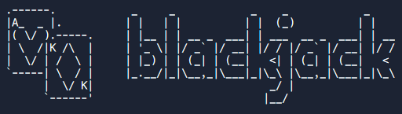

## Introduction

This is a simple text-based Blackjack game implemented in Python. The game involves a user playing against the computer, with the goal of getting a hand value as close to 21 as possible without exceeding it.

## How to Play

1. The game starts by dealing two cards to both the user and the computer.
2. The user is then prompted to decide whether to draw another card ("Y" for Yes or "N" for No).
3. If the user chooses to draw, another card is added to their hand, and the computer may also draw if its score is below a certain threshold.
4. The game continues until the user decides to stop drawing or until their hand value exceeds 21.
5. The winner is determined based on the final scores, and the option to restart the game is provided.

## Key Features

- Blackjack rules: The game adheres to standard Blackjack rules, including the value of cards and the goal of getting a hand value close to 21.
- User vs Computer: Play against a computer-controlled opponent.
- Dynamic scoring: The game adjusts the value of an Ace dynamically to maximize the user's chances of winning.
- Black Jack detection: The game recognizes when the user or computer achieves a "Black Jack" (an Ace and a 10-point card) and ends the game accordingly.

## Usage

1. Run the Python script in your terminal or preferred Python environment.
2. Follow the on-screen prompts to play the game.
3. Enjoy the simple text-based Blackjack experience!

